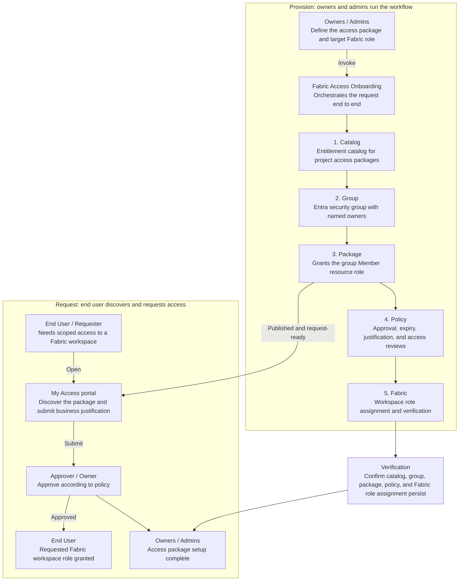

# Microsoft Fabric Access Onboarding

This utility provides a governed, repeatable workflow for onboarding users to Microsoft Fabric workspaces through Microsoft Entra entitlement management.

It guides an operator through:

- Entitlement catalog discovery and catalog creation escalation.
- Entra security group creation and owner assignment.
- Catalog resource registration.
- Access package and request policy configuration.
- Manager approval, expiry, and recurring access reviews.
- Microsoft Fabric workspace role assignment and verification.

The utility is adapted for the HRDIUtilities repository from the [`fabric-access-onboarding`](https://github.com/agency-microsoft/playground/tree/main/catalogs/hr-employee-experience/plugins/fabric-access-onboarding) Agency plugin.

## Architecture

Project owners and administrators run the onboarding workflow to publish a governed access package. End users discover and request that package in My Access, complete the configured approval process, and receive scoped Microsoft Fabric workspace access.



## Contents

```text
FabricAccessOnboarding/
  .github/
    instructions/
      copilot-instructions.md
    prompts/
      fabric-access-onboarding.prompt.md
  README.md
```

## Use in VS Code

1. Open the `FabricAccessOnboarding` folder in VS Code.
2. Open GitHub Copilot Chat in Agent mode.
3. Enter `/fabric-access-onboarding` and describe the access request.
4. Provide any missing catalog, owner, workspace, environment, and role details when prompted.
5. Review and explicitly approve outbound email before it is sent.
6. Review the final verification summary and retain useful object IDs for audit purposes.

Example request:

```text
/fabric-access-onboarding
Onboard Contributor access to the HRDI production processing workspace.
Use the TC_Catalog entitlement catalog and create an access package backed by a security group.
```

## Required information

Have the following information available:

| Input | Required | Notes |
|---|---|---|
| Entitlement catalog name | Yes | An existing catalog is reused. Missing catalogs require an email request. |
| Catalog description | When catalog is missing | Describe the project or workload served by the catalog. |
| Two FTE catalog owners | When catalog is missing | Owners must be resolved to exact Entra users. |
| ServiceTree ID and type | When catalog is missing | Talent Analytics ID: `<TALENT_ANALYTICS_SERVICETREE_ID>`. |
| Security group name | Yes | Prefer `<Project>-Fabric-<Environment>-<Area>-<Resource>-<Role>`. |
| Security group owners | Yes | Typically the current user and one named teammate. |
| Fabric workspace name | Yes | The workflow resolves its workspace ID by exact display name. |
| Fabric workspace role | Yes | `Viewer`, `Contributor`, `Member`, or `Admin`. |

Never guess email addresses or object IDs. Resolve named people and resources through the authenticated directory and Fabric APIs.

## Default access policy

Unless a request specifies otherwise, the generated access package policy uses:

- Self-service requests with requestor justification.
- One-stage Manager approval.
- The current user as fallback approver.
- 365-day assignment expiry.
- Quarterly access reviews.
- Manager as reviewer and current user as fallback reviewer.
- 25-day review duration.
- Access retained when a reviewer does not respond.

## Catalog creation boundary

The workflow does not directly create a missing entitlement catalog. Instead, it drafts a request to `CoreIdentityGroupsandEntitlements@microsoft.com` containing:

- Catalog Name.
- Catalog Description.
- Two FTE Owners.
- ServiceTree ID.
- ServiceTree Type.

The recipient and exact message are shown for explicit confirmation before sending. Provisioning remains blocked until the catalog exists.

## Fabric role assignment

The workflow resolves a workspace from the Fabric REST API and assigns the Entra security group as a group principal:

```json
{
  "principal": {
    "id": "<group-object-id>",
    "type": "Group"
  },
  "role": "<workspace-role>"
}
```

The Fabric workspace ID and workspace identity ID are different identifiers and must not be interchanged.

## Security and operational controls

- Browser, Microsoft Graph, Microsoft Fabric, Power BI, and Microsoft 365 tokens must never be printed or stored.
- Every named owner must be resolved to an exact Entra identity.
- Existing exact-name resources are reused to avoid duplicate groups and access packages.
- Persistent state is verified after each major stage.
- The workflow stops when identity resolution, catalog availability, or required permissions are blocked.
- Outbound email always requires explicit user confirmation.

## Completion criteria

Onboarding is complete only after verifying that:

1. The entitlement catalog exists.
2. The security group exists with the requested owners.
3. The group is registered as a catalog resource.
4. The access package includes the group `Member` resource role.
5. The request policy, approval, expiry, and access review settings persist.
6. The Fabric workspace role assignment exists for the group.

## Limitations

- The utility requires authenticated access to Microsoft Entra, Entitlement Management, and Microsoft Fabric.
- Tenant permissions and device-compliance policies may require portal-based steps instead of CLI or API operations.
- A missing entitlement catalog requires completion of the catalog request process before onboarding can continue.
