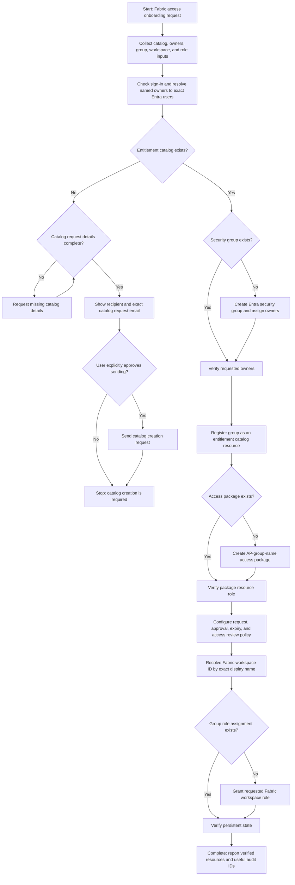

# Microsoft Fabric Access Onboarding End-to-End Flow

## Flow Diagram

## Purpose

This document defines the full operational flow for governed Microsoft Fabric access onboarding through Microsoft Entra entitlement management.

## Required Inputs

- Entitlement catalog display name.
- Catalog description, two FTE owners, ServiceTree ID, and ServiceTree type when the catalog is missing.
- Entra security group display name and requested owners.
- Access package display name, normally `AP-<security-group-name>`.
- Fabric workspace display name and requested workspace role.

Never guess email addresses, object IDs, workspace IDs, or tenant-specific values. Resolve people and resources through authenticated directory and Fabric APIs.

## Detailed End-to-End Steps

### 1. Validate Sign-In and Resolve Identities

- Confirm the current Microsoft 365 sign-in state and identify the current user.
- Resolve every named owner to one exact Entra user.
- Stop and request clarification when a name is ambiguous or cannot be resolved.

### 2. Find the Entitlement Catalog

- Search entitlement management catalogs by exact display name.
- Reuse the existing catalog when found.
- Do not create a missing catalog directly.

### 3. Escalate Missing Catalog Creation

- Collect the catalog name, description, two FTE owners, ServiceTree ID, and ServiceTree type.
- Draft the catalog creation request to `CoreIdentityGroupsandEntitlements@microsoft.com`.
- Show the recipient and exact email content and wait for explicit user confirmation before sending.
- Stop provisioning after the request is sent. Group, package, policy, and workspace setup remain blocked until the catalog exists.

### 4. Create or Reuse the Security Group

- Search for the requested Entra security group by exact display name.
- Reuse an exact-name match to avoid duplicates.
- Otherwise, create the security group and assign the resolved owners.
- Verify the group object ID and owner assignments persist.

### 5. Register the Catalog Resource

- Add the security group to the entitlement catalog as `Groups and Teams / Security`.
- Verify that the catalog resource references the intended group object ID.
- Use an authenticated portal path when Graph write operations are blocked by permission or device-compliance policy.

### 6. Create or Reuse the Access Package

- Use the name `AP-<security-group-name>` unless another name is requested.
- Reuse an exact-name package in the target catalog when it already exists.
- Add the security group resource and select its `Member` resource role.
- Verify the package and resource role association persist.

### 7. Configure the Request Policy

- Enable self-service requests and require requestor justification.
- Configure one-stage Manager approval with the current user as fallback approver.
- Use 365-day assignment expiry unless another duration is requested.
- Configure quarterly access reviews with Manager as reviewer, the current user as fallback reviewer, and a 25-day review duration.
- Keep access when a reviewer does not respond unless the user requests another behavior.
- Verify approval, expiry, justification, and review settings after creation.

### 8. Grant Fabric Workspace Access

- List Fabric workspaces and resolve the workspace ID by exact `displayName` match.
- Do not substitute the workspace identity ID for the workspace ID.
- Resolve the security group object ID and create a group-principal role assignment for the requested `Viewer`, `Contributor`, `Member`, or `Admin` role.
- Reuse an existing equivalent role assignment instead of creating a duplicate.

### 9. Verify Persistent State

Confirm that:

1. The entitlement catalog exists.
2. The security group exists with the requested owners.
3. The group is registered as a catalog resource.
4. The access package includes the group `Member` resource role.
5. The request policy, approval, expiry, and access review settings persist.
6. The Fabric workspace role assignment exists for the group.

## Expected Output

Return a completion summary with any blockers or limitations. Include catalog, group, access package, policy, workspace, and role assignment identifiers only when they are useful for audit.

<!-- Contains AI-generated edits. -->