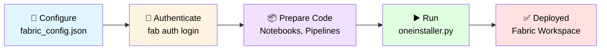
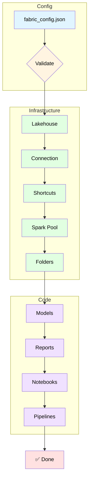
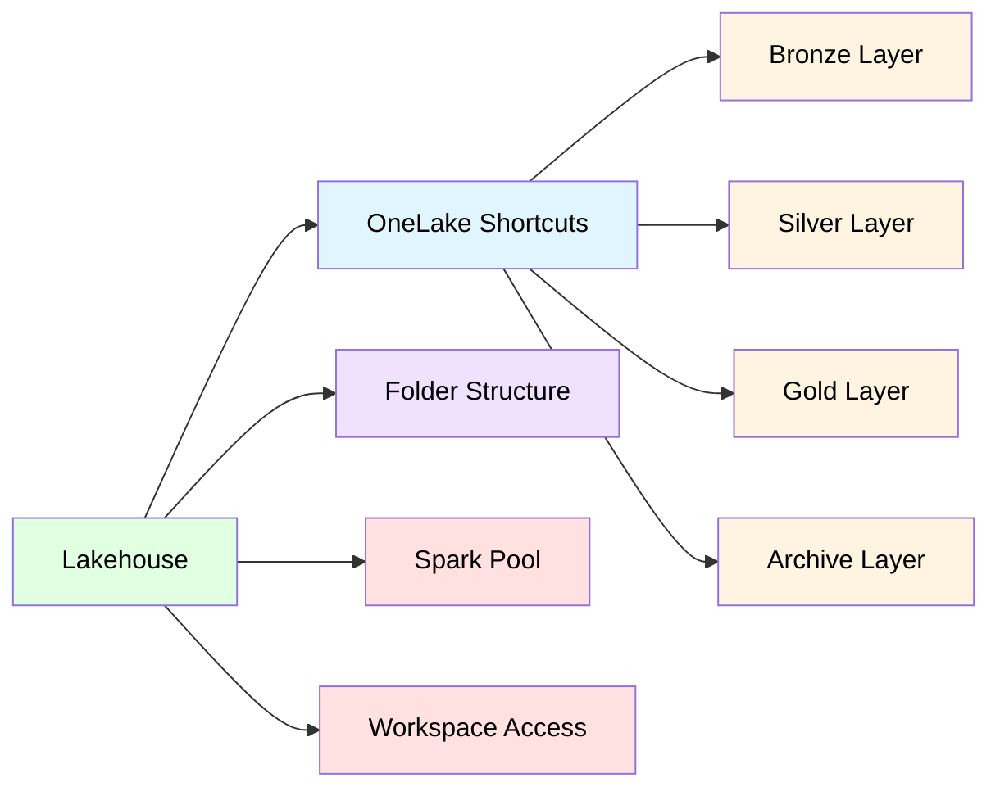
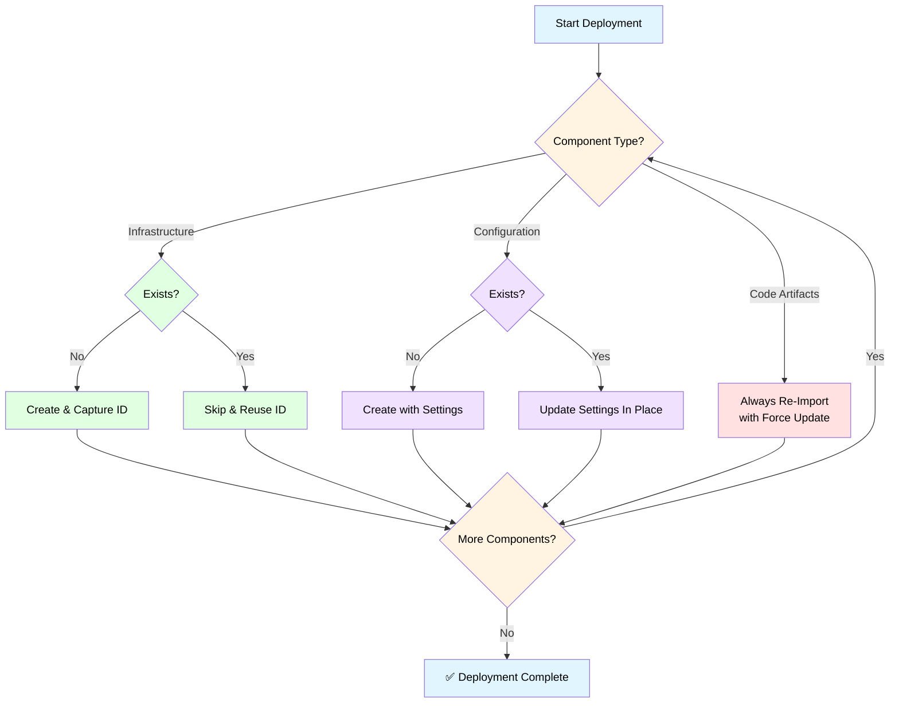

# Microsoft Fabric CLI Deployment Kit

**Automated, config-driven deployment for Microsoft Fabric workspaces** — Infrastructure and code artifacts deployed python commands using the Fabric CLI.

## Contents

- [Overview](#overview)
- [Repository Structure](#repository-structure)
- [Preparing Code for Deployment](#preparing-code-for-deployment)
- [Terminal-Based Deployment](#terminal-based-deployment)
- [Troubleshooting Guide](#troubleshooting-guide)
- [Post-Deployment Verification](#post-deployment-verification)
- [Re-Run Behavior & Idempotent Design](#re-run-behavior--idempotent-design)
- [Quick Reference](#quick-reference)
- [Extending This Framework](#extending-this-framework)
- [Additional Resources](#additional-resources)

---

## Overview

This deployment kit provides a **terminal-based, script-driven approach** for deploying complete Microsoft Fabric environments with maximum control and flexibility. Perfect for administrators who prefer hands-on deployment management.



### Key Features

| Feature | Description |
|---------|-------------|
| **Direct Control** | Execute deployment scripts directly from command line |
| **Step-by-Step Execution** | Deploy components individually with validation at each step |
| **Troubleshooting Flexibility** | Pause, modify, and resume deployment as needed |
| **Idempotent Design** | Safe to re-run at any point — no duplicates, no teardown |
| **Comprehensive Logging** | Detailed logs + CSV audit trail for every deployment |

## Repository Structure

```
FabricCLI/
  ├── Config/
  │   └── fabric_config.json          ← Single source of truth
  ├── Code/
  │   └── Fabric/
  │       ├── Notebooks/              ← Place your notebook artifacts here
  │       ├── Pipelines/              ← Place your pipeline definitions here
  │       ├── Models/                 ← Place your semantic models (TMDL) here
  │       └── Reports/                ← Place your Power BI reports here
  ├── SampleCode/                     ← Reference examples for code prep(notebooks,pipelines)
  ├── DeploymentScrips/
  │   ├── oneinstaller.py             ← Master orchestrator
  │   ├── fabric_infra_deploy.py      ← Infrastructure deployment
  │   ├── fabric_code_deploy.py       ← Code deployment
  │   └── shared_logger.py            ← Logging utilities
  └── Logs/
      ├── runninglog_DDMMYYYY.txt     ← Detailed execution log
      └── deployment_log_DDMMYYYY.csv ← Structured audit trail
```

## Preparing Code for Deployment

Export your artifacts, replace hardcoded values with `##placeholders##`, and drop them into the right folder. For detailed guidance on folder structure, `.platform` files, placeholder syntax, and naming conventions, see the [Code Preparation Guide](../Code/Fabric/README.md).

### Step 1: Export Artifacts

Use `fab export` to pull artifacts from an existing workspace:

```bash
# Notebooks
fab export "MyWorkspace.Workspace/MyNotebook.Notebook" -f -o "Code/Fabric/Notebooks/"

# Pipelines
fab export "MyWorkspace.Workspace/MyPipeline.DataPipeline" -f -o "Code/Fabric/Pipelines/"

# Semantic Models
fab export "MyWorkspace.Workspace/MyModel.SemanticModel" -f -o "Code/Fabric/Models/"

# Reports
fab export "MyWorkspace.Workspace/MyReport.Report" -f -o "Code/Fabric/Reports/"
```

Each export creates a folder (e.g., `MyNotebook.Notebook/`) with a `.platform` file and content files — ready to deploy.

### Step 2: Add Placeholders

Open the exported files and replace hardcoded IDs, connection strings, and names with `##parameterName##` tokens. The deployment scripts swap these with values from `fabric_config.json` at deploy time.

**Where to look:**

| Artifact | File to Edit | What to Replace |
|----------|-------------|------------------|
| Notebooks | `notebook-content.ipynb` | Lakehouse IDs, storage accounts, workspace IDs |
| Pipelines | `pipeline-content.json` | Notebook references (`##NotebookName##`), workspace IDs |
| Models | `*.tmdl` files in `definition/` | Data source connection strings, server names |
| Reports | `definition.pbir` | Semantic model ID (`##semanticModelId##`) |

**Quick examples:**

```python
# In notebooks
LAKEHOUSE_ID = "##fabricLakehouseId##"
STORAGE_ACCOUNT = "##storageAccountName##"
```

```json
// In pipelines — reference notebooks by name (without .Notebook suffix)
"notebookId": "##DataIngestion##"
```

```json
// In reports — auto-resolved to the matching model's GUID
"pbiModelDatabaseName": "##semanticModelId##"
```

### Step 3: Naming Rules

The scripts auto-wire artifacts together using naming conventions:

- **Reports ↔ Models** — must share the same base name:
  `SalesAnalysis.SemanticModel` + `SalesAnalysis.Report` ✅
- **Pipelines → Notebooks** — use `##NotebookName##` without the `.Notebook` suffix:
  `DataIngestion.Notebook` → `##DataIngestion##` ✅

**Deployment order is automatic:** Models → Reports → Notebooks → Pipelines (each step captures IDs for the next).

> 📖 **Need more detail?** See the [Code Preparation Guide](../Code/Fabric/README.md) for full examples, `.platform` file format, placeholder syntax per artifact type, and naming convention deep-dives. For working samples, check the `SampleCode/` folder.

## Terminal-Based Deployment

> **Viewing Diagrams:** The diagrams in this README use Mermaid syntax. VS Code's built-in markdown preview doesn't render them by default. To view diagrams:
> - **Option 1:** Install [Markdown Preview Mermaid Support](https://marketplace.visualstudio.com/items?itemName=bierner.markdown-mermaid) extension
> - **Option 2:** View this README on GitHub (automatic rendering)
> - **Option 3:** Use browser-based markdown preview

### Deployment Architecture



### Prerequisites

Before starting deployment, ensure you have:

- ✅ **Python 3.10+** installed
- ✅ **Fabric CLI** installed (`pip install ms-fabric-cli`)
- ✅ **Admin access** to target Fabric workspace
- ✅ **Fabric Workspace Identity with Storage Blob Data Contributor** on storage account *(only if using connections/shortcuts)*

### 📝 Step 1: Configuration

The `fabric_config.json` file is your deployment blueprint. It contains all parameters needed for infrastructure provisioning and code deployment. An example is made available in config folder, just for reference.

**Location:** `<repo>/Config/fabric_config.json`

#### Essential Parameters (Required)

```json
{
  "fabricWorkspaceName": {
    "value": "contoso_analytics_dev_ws"  // Target Fabric workspace name
  },
  "tenantName": {
    "value": "contoso"  // Organization short name (used as prefix)
  },
  "environmentName": {
    "value": "dev"  // Environment: dev, test, or prod
  },
  "fabricWorkspaceIdentity": {
    "value": "xxxxxxxx-xxxx-xxxx-xxxx-xxxxxxxxxxxx"  // Workspace managed identity GUID
  }
}
```

#### Optional Parameters

| Parameter | Description | Default Behavior |
|-----------|-------------|------------------|
| `fabricLakehouseName` | Name of the lakehouse in fabric workspace | If provided, reuses an existing lakehouse with that name or creates a new one. If blank, auto-generates as `<tenantName>_lakehouse_<environmentName>`. |
| `storageAccountName` | ADLS Gen2 storage account name. Only needed if you want to create connections and OneLake shortcuts. If placeholder is not updated or value is empty, connection and shortcut creation are skipped entirely. | if empty, skips connection and shortcut creation |
| `SPNObjectID` | Enterprise Application Object ID for granting workspace RBAC access. | Skipped if empty |
| `logAnalyticsWorkspaceId` | Log Analytics workspace GUID. If any of your Fabric artifacts (notebooks, models, etc.) reference this placeholder (`##logAnalyticsWorkspaceId##`), provide the ID here so it gets wired into those artifacts during deployment. | Not injected if empty |
| `folderConfiguration` | Defines folders to create inside the Lakehouse `Files/` area. Each entry is a path — nested paths are created in order. Customize the folder names and structure to match your project needs, or remove this section entirely if you don't need folders. See example below. | If the defaults are left as is, the script attempts to create the folder paths specified in the config (e.g., `metadata/v1`). |
| `shortcutConfiguration` | Defines OneLake shortcuts to containers in your ADLS Gen2 storage account. Each shortcut maps to a container name — update the `name`, `containerName`, and `description` to match your actual storage containers. You can add, remove, or rename shortcuts to fit your architecture (e.g., bronze/silver/gold, or any custom container names). Requires `storageAccountName` and `connectionConfiguration`. See example below. | Creates a shortcut per entry using the `containerName` value. Defaults are bronze, silver, gold. **Shortcuts fail if the containers don’t exist** in your storage account — update names to match yours. Keep only the entries you need (even just one), or remove the entire section to skip shortcut creation. |
 |

**Folder Configuration Example** — customize to your needs:
```json
"folderConfiguration": {
  "value": {
    "folder1": "archive",
    "folder2": "metadata",
    "folder3": "metadata/v1",
    "folder4": "metadata/v2"
  }
}
```
Folders are created **in order** inside the Lakehouse `Files/` area. Use `/` in the path to create nested folders — the script creates parent folders first, then children. The result of the above config:
```
Lakehouse/
  └── Files/
      ├── archive/
      └── metadata/
          ├── v1/
          └── v2/
```
Add, rename, or remove entries to match your project. Remove this entire section if you don't need folders in the lakehouse.

**Shortcut Configuration Example** — map to your own containers:
```json
"shortcutConfiguration": {
  "value": {
    "shortcuts": [
      {
        "name": "rawdata",
        "displayName": "Raw Data",
        "containerName": "rawdata",
        "subPath": "/",
        "description": "Raw ingested data"
      },
      {
        "name": "processed",
        "displayName": "Processed",
        "containerName": "processed",
        "subPath": "/",
        "description": "Cleaned and transformed data"
      }
    ]
  }
}
```
Each shortcut's `containerName` must match an existing container in your storage account. Add or remove entries to match your containers — there's no fixed requirement for specific names like bronze/silver/gold.

#### Auto-Resolved Parameters (Do Not Fill)

| Parameter | How It's Populated |
|-----------|-------------------|
| `fabricWorkspaceId` | Resolved from `fabricWorkspaceName` via `fab get` |
| `fabricLakehouseId` | Set after lakehouse creation or detection |
| `lakehouseConnString` | Set after lakehouse creation or detection |
| `modelConfiguration` | Populated when semantic models are deployed |
| `notebookConfiguration` | Populated when notebooks are deployed |

**💡 Extensible by design:** You can add any custom parameter to `fabric_config.json`. During code deployment, the script scans all artifact files for `##parameterName##` placeholders — if it finds a match in the config, it replaces it automatically. No code changes needed. Just add your parameter, use the matching placeholder in your artifacts, and the deployment handles the rest.

#### 🔍 Where to Find Configuration Values

**Workspace Identity (Managed Identity):**
1. Open [Microsoft Fabric](https://app.fabric.microsoft.com/) and navigate to your workspace
2. Click the **Settings** gear icon (⚙️) in the top-right corner of the workspace
3. In the left panel, select **Workspace Identity**
4. If no identity exists, click **+ Create workspace identity** and wait for it to provision
5. Once created, copy the **Identity ID** (GUID) — this is your `fabricWorkspaceIdentity` value
6. To grant storage access: go to **Azure Portal** → your **Storage Account** → **Access Control (IAM)** → **Add role assignment** → assign **Storage Blob Data Contributor** to the workspace identity name

**Storage Account** (Optional — only if using connections/shortcuts):
- In the Azure Portal, navigate to your storage account and copy the name

**Service Principal Object ID** (Optional):
- In Entra ID → Enterprise Applications → find your app
- Copy the **Object ID** (NOT the Application ID from App Registrations)

### 🔐 Step 2: Environment Setup & Authentication

#### Authenticate with Fabric CLI

```bash
# Login to Fabric
fab auth login

# Verify authentication
fab workspace list
```

#### Verify Access Permissions

Ensure you have the required access before proceeding:

| Resource | Required Access | When Needed |
|----------|----------------|-------------|
| Fabric Workspace | **Admin** | Always |
| Storage Account | **Storage Blob Data Contributor** (via Workspace Identity) | Only if using connections/shortcuts |
| Service Principal | **Enterprise App Object ID** | Only if granting SPN workspace access |

### ▶️ Step 3: Run the Deployment

Navigate to the deployment scripts directory and execute the installer:

```bash
cd <cloned-repo>/DeploymentScrips
python oneinstaller.py
```

#### What Happens During Deployment


The script orchestrates the following:

1. **🔍 Pre-flight Checks**
   - Verifies CLI tools (Python, Fabric CLI)
   - Validates Fabric authentication
   
2. **⚙️ Workspace Validation**
   - Parses `fabric_config.json`
   - Checks required parameters
   - Prompts for user review and confirmation (Y/N)

3. **🏗️ Infrastructure Deployment** (`fabric_infra_deploy.py`)
   - Creates/validates Lakehouse
   - Creates ADLS Gen2 connection
   - Creates OneLake shortcuts (bronze/silver/gold/archive)
   - Configures Spark pool (node size, auto-scale)
   - Creates folder structure in Lakehouse
   - Grants workspace access (SPN + Workspace Identity)

4. **💻 Code Deployment** (`fabric_code_deploy.py`)
   - Deploys Semantic Models → captures IDs
   - Deploys Reports → binds to models via `##semanticModelId##`
   - Deploys Notebooks → captures IDs
   - Deploys Pipelines → binds to notebooks via `##NotebookName##`
   - Replaces all `##placeholder##` tokens with config values

5. **✅ Verification & Logging**
   - Prints deployment summary
   - Outputs resource endpoints and key configuration values
   - Saves detailed logs to `Logs/` directory

### 📊 Step 4: Monitor Deployment Status

#### Real-Time Console Output

Watch the terminal for incremental status updates:

```
═══════════════════════════════════════════
  FABRIC WORKSPACE DEPLOYMENT
═══════════════════════════════════════════

[INFO] Workspace ID resolved: xxxxxxxx-xxxx-xxxx-xxxx-xxxxxxxxxxxx
[INFO] Creating Lakehouse: contoso_lakehouse_dev
[SUCCESS] Lakehouse created successfully
[INFO] Creating connection: contoso_adls_connection_dev
[SUCCESS] Connection created successfully
[INFO] Creating shortcut: bronze → /bronze
[SUCCESS] Shortcut created successfully
...
```

#### Deployment Logs

All execution details are saved to the `Logs/` directory:

| Log File | Purpose | Format |
|----------|---------|--------|
| `runninglog_DDMMYYYY.txt` | Detailed execution log with timestamps | Plain text |
| `deployment_log_DDMMYYYY.csv` | Structured audit trail | CSV (importable to Excel) |

**CSV columns:** `Timestamp`, `Status`, `Component`, `Action`, `Result`, `ErrorDetails`

Use `--verbose` for detailed debug output during troubleshooting, or `--minimal` for clean SUCCESS/ERROR-only output in CI/CD pipelines. The CSV audit trail is structured for easy import into Power BI — build a deployment dashboard to track deployment history, failure trends, and component-level status across environments.

#### Deployment Summary

At the end, the script displays a summary for each phase:

**Infrastructure Deployment Complete:**

```
═══════════════════════════════════════════════════════════
              INFRASTRUCTURE SUMMARY
═══════════════════════════════════════════════════════════

  Lakehouse:        contoso_lakehouse_dev          ✅ Created
  Connection:       contoso_adls_connection_dev    ✅ Created
  Shortcuts:        3/3 created                    ✅ Done
  Spark Pool:       analytics-spark-pool           ✅ Configured
  Folders:          4/4 created                    ✅ Done
  Workspace Access: 2/2 configured                 ✅ Done

  Infrastructure deployment completed successfully!
═══════════════════════════════════════════════════════════
```

**Code Deployment Complete:**

```
═══════════════════════════════════════════════════════════
              CODE DEPLOYMENT SUMMARY
═══════════════════════════════════════════════════════════

  Semantic Models:  2/2 deployed                   ✅ Done
  Reports:          2/2 deployed                   ✅ Done
  Notebooks:        9/9 deployed                   ✅ Done
  Pipelines:        1/1 deployed                   ✅ Done

  Code deployment completed successfully!
═══════════════════════════════════════════════════════════
```

### 🎛️ Command-Line Options

Control deployment behavior with command-line flags:

```bash
# Detailed debug output
python oneinstaller.py --verbose

# Minimal output (SUCCESS/ERROR only)
python oneinstaller.py --minimal

# Deploy infrastructure only (skip code)
python oneinstaller.py --skip-code

# Deploy code only (skip infrastructure)
python oneinstaller.py --skip-infra
```

### 🔧 Individual Component Deployment

Run deployment scripts individually for targeted operations:

```bash
# Deploy infrastructure only
python fabric_infra_deploy.py

# Deploy code artifacts only
python fabric_code_deploy.py
```

## Troubleshooting Guide

For common issues, solutions, log analysis, and best practices, see the [Troubleshooting Guide](TROUBLESHOOTING.md).

## Post-Deployment Verification

Upon successful deployment, verify the following components in your Fabric workspace:

### 🏗️ Infrastructure Components



| Component | What to Verify |
|-----------|----------------|
| **Lakehouse** | Created with the specified name, accessible in workspace |
| **Connection** | ADLS Gen2 connection created, credential configured |
| **Shortcuts** | Bronze, silver, gold, archive shortcuts pointing to storage containers |
| **Spark Pool** | Custom pool created with correct node size and auto-scale settings |
| **Folders** | Folder hierarchy created under Files/ in lakehouse |
| **Workspace Access** | SPN and Workspace Identity granted appropriate roles |

### 💻 Code Artifacts

| Component | What to Verify |
|-----------|----------------|
| **Semantic Models** | All models deployed, refresh scheduled if configured |
| **Reports** | Reports accessible, bound to correct semantic models |
| **Notebooks** | All notebooks deployed, placeholders replaced, runnable |
| **Pipelines** | Pipelines deployed, notebook activities correctly bound |

### 🧪 Quick Validation Steps

1. **Open the Fabric workspace** in your browser
2. **Navigate to each section:**
   - Lakehouses → verify lakehouse existence
   - Semantic Models → verify model deployment
   - Reports → open reports and verify data loads
   - Notebooks → run a simple cell to verify execution
   - Pipelines → inspect notebook activities for correct IDs
3. **Check logs** in the lakehouse Files/ area for deployment artifacts
4. **Run a test pipeline** (if applicable) to verify end-to-end flow

### 📊 Deployment Status Report

The scripts generate a summary report at completion:

```
═══════════════════════════════════════════════════════════
              DEPLOYMENT SUMMARY
═══════════════════════════════════════════════════════════

Infrastructure:
  ✅ Lakehouse: contoso_lakehouse_dev
  ✅ Connection: contoso_adls_connection_dev
  ✅ Shortcuts: 4/4 created (bronze, silver, gold, archive)
  ✅ Spark Pool: analytics-spark-pool (Medium, 1-10 nodes)
  ✅ Folders: 3/3 created
  ✅ Workspace Access: 2/2 configured

Code Artifacts:
  ✅ Semantic Models: 2/2 deployed
  ✅ Reports: 2/2 deployed
  ✅ Notebooks: 9/9 deployed
  ✅ Pipelines: 1/1 deployed

Next Steps:
  → Schedule semantic model refresh in Fabric portal
  → Configure pipeline triggers if needed
  → Run test notebooks to validate data access
  → Monitor pipeline execution logs

═══════════════════════════════════════════════════════════
```

### How Components Work Together

#### 🗂️ Folder Creation

**When:** If `folderConfiguration` is provided  
**Behavior:** Creates nested folder structure in Lakehouse `Files/` area

```json
"folderConfiguration": {
  "value": {
    "folder1": "metadata",
    "folder2": "metadata/v1",
    "folder3": "metadata/v2"
  }
}
```

**Result:**
```
Lakehouse/
  └── Files/
      └── metadata/
          └── v1/
          └── v2/
```

**Use case:** Organize ingested files, notebooks, and data assets

---

#### 🔌 Connection Creation (ADLS Gen2)

**When:** If `storageAccountName` AND `connectionConfiguration` are provided  
**Skipped:** If `storageAccountName` is `None`, empty, or `##placeholder##`

**Requirements:**
1. `storageAccountName` — Name of the storage account
2. `fabricWorkspaceIdentity` — Managed identity with Storage Blob Data Contributor role
3. `connectionConfiguration` — Connection template (see below)

**Connection is auto-named:** `<tenantName>_<connectionName>_<environmentName>`

**Example:** `tenantName="contoso"` + `connectionName="adls_connection"` + `environmentName="dev"` → **`contoso_adls_connection_dev`**

```json
"connectionConfiguration": {
  "value": {
    "connectionName": "adls_connection",
    "displayName": "ADLS Gen2 Connection",
    "connectivityType": "ShareableCloud",
    "connectionDetails": {
      "type": "AzureDataLakeStorage",
      "parameters": {
        "serverSuffix": "dfs.core.windows.net",
        "path": "/"
      }
    },
    "credentialDetails": {
      "type": "WorkspaceIdentity"
    }
  }
}
```

---

#### 🔗 Shortcut Creation (Medallion Architecture)

**When:** If `storageAccountName` AND `connectionConfiguration` AND `shortcutConfiguration` are provided  
**Skipped:** If `storageAccountName` is `None`, empty, or `##placeholder##`

**Prerequisites:**
1. Connection created (see above)
2. Storage containers exist in ADLS Gen2
3. Workspace Identity has Storage Blob Data Contributor on containers

**Medallion Architecture Example:**

```json
"shortcutConfiguration": {
  "value": {
    "shortcuts": [
      {
        "name": "bronze",
        "displayName": "Bronze",
        "containerName": "bronze",
        "subPath": "/",
        "description": "Raw ingested data"
      },
      {
        "name": "silver",
        "displayName": "Silver",
        "containerName": "silver",
        "subPath": "/",
        "description": "Cleaned and transformed data"
      },
      {
        "name": "gold",
        "displayName": "Gold",
        "containerName": "gold",
        "subPath": "/",
        "description": "Aggregated data ready for consumption"
      },
      {
        "name": "archive",
        "displayName": "Archive",
        "containerName": "archive",
        "subPath": "/",
        "description": "Historical and backup data"
      }
    ]
  }
}
```

**Result in Lakehouse:**
```
Lakehouse/
  └── Files/
      ├── bronze/        → Points to adlsgen2://storage/bronze/
      ├── silver/        → Points to adlsgen2://storage/silver/
      ├── gold/          → Points to adlsgen2://storage/gold/
      └── archive/       → Points to adlsgen2://storage/archive/
```

**Data Flow:**
```
Raw Data → bronze → [ETL Notebook] → silver → [Aggregation Notebook] → gold → [Power BI Report]
                                                                            ↓
                                                                         archive
```

---


## Re-Run Behavior & Idempotent Design

The deployment kit is **safe to re-run at any point**. Each component follows one of three strategies depending on its nature:



### Behavior by Component

#### 🏗️ Infrastructure — Skip if exists

Resources like the lakehouse, connection, and shortcuts are **created once**. On re-run, the script detects they already exist, skips creation, and retrieves their IDs for downstream use.

| Component | If New | If Exists |
|-----------|--------|----------|
| **Lakehouse** | Create & capture ID | Skip, reuse existing ID |
| **Connection** | Create with workspace identity | Skip, reuse existing |
| **Shortcuts** | Create links to storage containers | Skip (already linked) |
| **Folders** | Create folder hierarchy | Skip (already exists) |

#### ⚙️ Configuration — Update in place

Configuration-driven components like the Spark pool are expected to change over time. Users may want to adjust node sizes, auto-scale ranges, or other settings across deployments. On re-run, the script **applies the latest settings from `fabric_config.json`**.

| Component | If New | If Exists |
|-----------|--------|----------|
| **Spark Pool** | Create with configured settings | **Update** node size, auto-scale, min/max nodes |
| **Workspace Access** | Grant roles to identities | Re-apply role assignments |

#### 💻 Code Artifacts — Always update

Code is expected to change frequently. Notebooks get refined, pipeline logic evolves, models add new measures, reports get new visuals. On every run, code artifacts are **force re-imported** (`-f` flag) so the deployed version always matches your source. Artifact IDs are preserved, so all cross-references (pipeline → notebook, report → model) remain valid.

| Component | Behavior on Every Run |
|-----------|-----------------------|
| **Notebooks** | Re-import with `-f` (latest code deployed) |
| **Pipelines** | Re-import with `-f` (latest logic deployed) |
| **Semantic Models** | Re-import with `-f` (latest model definition) |
| **Reports** | Re-import with `-f` (latest visuals/layout) |

### Why This Matters

- **First deployment** — everything gets created end to end
- **Subsequent deployments** — infrastructure is untouched, config is updated, code is refreshed
- **After a failure** — re-run picks up where it left off, skipping what's already done
- **After code changes** — only code artifacts are updated, infrastructure stays stable
- **After config changes** — Spark pool settings, access roles are applied without recreating anything

This design ensures that re-running the deployment is always safe, predictable, and efficient — no teardown, no duplicates, no surprises.

---
### Deployment Scenarios

#### Scenario 1: Basic Fabric-Only Deployment (No External Storage)

**Use case:** Deploy only to Fabric, no ADLS Gen2 integration

**Required parameters:**
```json
{
  "fabricWorkspaceName": { "value": "MyWorkspace" },
  "tenantName": { "value": "contoso" },
  "environmentName": { "value": "dev" }
}
```
*Simply omit `storageAccountName`, `connectionConfiguration`, and `shortcutConfiguration` — the script skips them.*

**What gets deployed:**
- ✅ Lakehouse (auto-named or custom)
- ✅ Spark Pool (if configured)
- ✅ Folders (if configured)
- ✅ Notebooks, Pipelines, Models, Reports
- ❌ Connection (skipped — no storage account)
- ❌ Shortcuts (skipped — no storage account)
- ❌ Workspace RBAC (skipped — no identities configured)

---

#### Scenario 2: Full Deployment with External Storage (Medallion Architecture)

**Use case:** Enterprise deployment with ADLS Gen2 medallion architecture

**Required parameters:**
```json
{
  "fabricWorkspaceName": { "value": "AnalyticsWorkspace" },
  "tenantName": { "value": "contoso" },
  "environmentName": { "value": "prod" },
  "storageAccountName": { "value": "contosodatalakeprod" },
  "fabricWorkspaceIdentity": { "value": "xxxxxxxx-xxxx-..." },
  "connectionConfiguration": { "value": { ... } },
  "shortcutConfiguration": { "value": { "shortcuts": [...] } }
}
```

**What gets deployed:**
- ✅ Lakehouse
- ✅ Connection to ADLS Gen2
- ✅ Shortcuts (bronze/silver/gold/archive)
- ✅ Spark Pool
- ✅ Folders
- ✅ Workspace RBAC (Workspace Identity + SPN if configured)
- ✅ Notebooks, Pipelines, Models, Reports

---

#### Scenario 3: Development Environment (Minimal Setup)

**Use case:** Quick dev/test environment, minimal infrastructure

**Required parameters:**
```json
{
  "fabricWorkspaceName": { "value": "DevWorkspace" },
  "tenantName": { "value": "contoso" },
  "environmentName": { "value": "dev" },
  "fabricLakehouseName": { "value": "dev_lakehouse" }
}
```

**What gets deployed:**
- ✅ Lakehouse (with custom name — if `dev_lakehouse` already exists, reuses it)
- ✅ Notebooks, Pipelines, Models, Reports
- ❌ Everything else skipped (minimal deployment)

---

### Additional Info on Params:

### Auto-Fill Behavior

| Parameter | When Auto-Filled | How It's Generated | Can Override? |
|-----------|------------------|-------------------|---------------|
| `fabricWorkspaceId` | Always | `fab get <workspaceName> -q id` | No (always derived) |
| `fabricLakehouseName` | If blank | `<tenantName>_lakehouse_<environmentName>` | Yes (provide value) |
| `fabricLakehouseId` | After lakehouse creation | `fab get <lakehouse> -q id` | No (always derived) |
| `lakehouseConnString` | After lakehouse creation | `fab get <lakehouse> -q properties.sqlEndpointProperties.connectionString` | No (always derived) |
| `modelConfiguration` | After deploying models | `fab get <model> -q id` for each deployed model | No (always derived) |
| `notebookConfiguration` | After deploying notebooks | `fab get <notebook> -q id` for each deployed notebook | No (always derived) |

**💡 Tip:** Parameters marked "always derived" are managed automatically — don't fill them manually in your config!

### Advanced Configuration (Optional)

<details>
<summary><strong>🔌 Connection Configuration</strong></summary>

Defines the ADLS Gen2 connection for shortcuts:

```json
"connectionConfiguration": {
  "value": {
    "connectionName": "adls_connection",
    "displayName": "ADLS Gen2 Connection",
    "connectivityType": "ShareableCloud",
    "connectionDetails": {
      "type": "AzureDataLakeStorage",
      "parameters": {
        "serverSuffix": "dfs.core.windows.net",
        "path": "/"
      }
    },
    "credentialDetails": {
      "type": "WorkspaceIdentity"
    }
  }
}
```

**Key Properties:**
- `connectionName` — Prefixed with tenant name, suffixed with environment
- `credentialDetails.type` — `WorkspaceIdentity` or `ServicePrincipal`
- `serverSuffix` — Combined with `storageAccountName` for full URL

</details>

<details>
<summary><strong>🔗 Shortcut Configuration</strong></summary>

Defines OneLake shortcuts to external storage (medallion architecture):

```json
"shortcutConfiguration": {
  "value": {
    "shortcuts": [
      {
        "name": "bronze",
        "displayName": "Bronze",
        "containerName": "bronze",
        "subPath": "/",
        "description": "Raw ingested data"
      },
      {
        "name": "silver",
        "displayName": "Silver",
        "containerName": "silver",
        "subPath": "/",
        "description": "Cleaned and transformed data"
      },
      {
        "name": "gold",
        "displayName": "Gold",
        "containerName": "gold",
        "subPath": "/",
        "description": "Aggregated data ready for consumption"
      },
      {
        "name": "archive",
        "displayName": "Archive",
        "containerName": "archive",
        "subPath": "/",
        "description": "Historical and backup data"
      }
    ]
  }
}
```

**Key Properties:**
- `containerName` — Must match existing container in storage account
- `subPath` — Path within container (use `/` for root)

</details>

<details>
<summary><strong>⚡ Spark Pool Configuration</strong></summary>

Defines custom Spark pool with compute guardrails:

```json
"poolConfiguration": {
  "value": {
    "name": "analytics-spark-pool",
    "nodeSize": "Medium",
    "autoScale": "Enabled",
    "autoScale.minNodeCount": 1,
    "autoScale.maxNodeCount": 10
  }
}
```

**Node Sizes:** `Small`, `Medium`, `Large`, `XLarge`, `XXLarge`

**Auto-Scale:**
- `Enabled` — Dynamic scaling between min/max nodes
- `Disabled` — Fixed node count

</details>

<details>
<summary><strong>📁 Folder Configuration</strong></summary>

Defines folder hierarchy in Lakehouse Files/ area:

```json
"folderConfiguration": {
  "value": {
    "folder1": "analytics",
    "folder2": "analytics/v1",
    "folder3": "analytics/v1/CDM"
  }
}
```

**Folders are created in order** — supports nested structures.

</details>


---

## Quick Reference

### Installation Commands

```bash
# Install Fabric CLI
pip install ms-fabric-cli

# Authenticate
fab auth login

# Verify authentication
fab workspace list
```

### Deployment Commands

```bash
# Full deployment
python oneinstaller.py

# Infrastructure only
python oneinstaller.py --skip-code
python fabric_infra_deploy.py

# Code only
python oneinstaller.py --skip-infra
python fabric_code_deploy.py

# Verbose mode
python oneinstaller.py --verbose

# Minimal output
python oneinstaller.py --minimal
```

### Debugging Commands

```bash
# Check workspace existence
fab workspace get "WorkspaceName" -f

# List lakehouse
fab lakehouse list "WorkspaceName" -f

# Verify connection
fab connection list "WorkspaceName" -f

# Check notebook deployment
fab notebook get "WorkspaceName" -n "NotebookName" -f

# View logs
cat Logs/runninglog_DDMMYYYY.txt
```

---

**📝 Note:** This deployment kit is designed for terminal-based, manual deployment scenarios. For CI/CD pipeline integration, consider adapting the scripts to run in Azure DevOps or GitHub Actions with service principal authentication.

**📝 Note:** Sensitivity labels are not preserved when exporting artifacts to local. Verify and re-apply sensitivity labels on your artifacts in the Fabric Workspace after deployment.

**📝 Note:** Try this deployment scripts on dev workspaces first, understand how the deployment works and then move foward to higher environments.

---

## Extending This Framework

This deployment kit is a **starting point and a reference implementation** - it demonstrates how Fabric workspace deployments can be fully automated using the Fabric CLI and a config-driven approach. You can adapt and extend it to fit your specific requirements:

- **Add more artifact types** - extend the code deployment to support additional Fabric item types as they become available in the CLI
- **Customize the config schema** - add new parameters, remove unused ones, or restructure to match your team's conventions
- **Support multiple workspaces** - loop over an array of workspace configs to deploy across environments (dev → test → prod)
- **Integrate with CI/CD** - wrap the scripts in Azure DevOps pipelines or GitHub Actions for fully automated deployments on merge
- **Add pre/post deployment hooks** - run validation scripts, trigger data refreshes, or send notifications after deployment
- **Bring your own naming conventions** - modify the auto-naming logic for lakehouses, connections, and shortcuts to match your organization's standards
- **Build a script to do code prep** - Export commands are already shared, you can build a script to go through the artifacts of your dev workspace, export them to designated folders to make it ready for deployment

The config-driven design means the scripts stay generic - all environment-specific values live in `fabric_config.json`, making it straightforward to onboard new teams, workspaces, or deployment patterns without changing the deployment code.

---

## Additional Resources


- [Fabric CLI Docs](https://microsoft.github.io/fabric-cli/)
- [Fabric REST API Documentation](https://learn.microsoft.com/rest/api/fabric/articles/)
- [Microsoft Fabric Documentation](https://learn.microsoft.com/fabric/)

---

*Last Updated: April 2026 | Version: 1.0*
