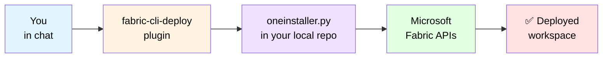
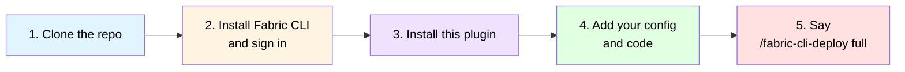

# fabric-cli-deploy

> **Fabric CLI Deploy** — One-command, config-driven Microsoft Fabric workspace deployment, bundled as a conversational agent skill.
>
> Wraps the [FabricCLI Deployment Kit](https://github.com/microsoft/HRDIUtilities/tree/main/FabricCLI) (`oneinstaller.py`) and exposes it as discrete, safe-to-invoke verbs.

---

## What it does

Stands up a complete Microsoft Fabric workspace — Lakehouse, Connections, Shortcuts, Spark Pools, OneLake folders, RBAC, plus code artifacts (Notebooks, Pipelines, Semantic Models, Reports) — from a single config file. Idempotent, dependency-aware, fully auditable.

## How it fits together

The plugin is the **operator's cockpit**. The deployment engine (`oneinstaller.py` and friends) lives in the [HRDIUtilities — FabricCLI](https://github.com/microsoft/HRDIUtilities/tree/main/FabricCLI) repo. You keep the repo locally; the plugin reads your `Config/fabric_config.json`, scans `Code/Fabric/**`, runs the engine for you, and turns the raw CSV log into a readable summary — so you only make the irreversible decisions.



## Get started in 5 minutes

You'll need: a Microsoft Fabric tenant where you have contributor/admin rights, Python 3.10+, and an AI client that supports plugins (Claude CLI, GitHub Copilot CLI, or compatible).



**Step 1 — Clone the repo, and keep it.** The plugin reads and writes inside this folder; it never moves things around.

```bash
git clone https://github.com/microsoft/HRDIUtilities.git
cd HRDIUtilities/FabricCLI
```

**Step 2 — Install the Fabric CLI and sign in once.** This is the only credential step. The plugin never sees your token.

```bash
pip install ms-fabric-cli
fab auth login
```

**Step 3 — Install this plugin in your AI client (one-time).**

```bash
agency marketplace add --mp playground
/plugin install fabric-cli-deploy@playground
```

**Step 4 — Drop in your config and code:**

- Copy `Config/fabric_config_example.json` → `Config/fabric_config.json` and fill in your workspace name, tenant short-name, and environment. The plugin will help you fill the rest — just run `/fabric-cli-deploy update-config`.
- Put your exported notebooks/pipelines/models/reports under `Code/Fabric/{Notebooks,Pipelines,Models,Reports}/`. The exact tree and how to use `fab export` are in [Where to put your Fabric code artifacts](#where-to-put-your-fabric-code-artifacts) below. Don't have any yet? Start with [`SampleCode/`](../../SampleCode/).

**Step 5 — Open your AI client inside the `FabricCLI/` folder and say:**

```text
/fabric-cli-deploy full
```

The skill asks at most three questions, runs pre-flight checks, and deploys. See [What a deployment conversation looks like](#what-a-deployment-conversation-looks-like) for an end-to-end transcript.

That's it. The plugin handles validation, secret redaction, the production-confirmation gate, log parsing, and the final summary for you.

## Trigger

Invoke the skill with any of these phrases or the explicit slash command:

| Trigger | Effect |
|---|---|
| `/fabric-cli-deploy full` | Full deployment (infra + code) |
| `/fabric-cli-deploy infra-only` | Skip code artifacts |
| `/fabric-cli-deploy code-only` | Skip infra (redeploy notebooks/pipelines only) |
| `/fabric-cli-deploy validate` | Pre-flight checks only, no deploy |
| `/fabric-cli-deploy plan` | Dry-run; print what would happen |
| `/fabric-cli-deploy update-config` | Interactively edit `fabric_config.json` |
| `/fabric-cli-deploy status` | List workspace contents via `fab ls` |
| `deploy a fabric workspace` | Natural language → resolves to `full` after intake |
| `redeploy fabric notebooks` | Natural language → resolves to `code-only` |
| `update spark pool` | Natural language → resolves to `infra-only` |

## What a deployment conversation looks like

```text
You:    /fabric-cli-deploy full
Skill:  I'll deploy a Fabric workspace. Three quick questions:
        1. Workspace name?
You:    contoso_dev_fabric_ws
Skill:  2. Environment? (dev / test / prod)
You:    dev
Skill:  3. Do you want to (a) use the existing Config/fabric_config.json
           or (b) update it interactively?
You:    a
Skill:  [1/6] ✓ Intake resolved
        [2/6] ✓ Pre-flight OK
        [3/6] ✓ Config validated
        [4/6] ✓ Artifacts inventoried — 4 notebooks, 1 pipeline, 1 model, 1 report
        [5/6] ⏳ Deploying…
        [6/6] ✓ Summary ready
        
        ============================================================
          Microsoft Fabric Deployment Summary
          ...
        ============================================================
```

A complete worked example with entity decomposition, dependency graph, resulting file tree, and a verbatim final summary lives in [`examples/contoso-retail-walkthrough.md`](./examples/contoso-retail-walkthrough.md).

## What's in this plugin

Layout follows the Agency marketplace plugin structure (Microsoft-internal reference: `https://eng.ms/docs/coreai/devdiv/one-engineering-system-1es/1es-jacekcz/startrightgitops/agency/tools/plugins/marketplaces`). The structure is compatible with the public Claude plugin convention (`.claude-plugin/plugin.json`):

```
plugins/fabric-cli-deploy/
├── .claude-plugin/
│   └── plugin.json                         ← Plugin manifest (required by Agency)
├── README.md                               ← This file (entry point)
├── PRIVACY.md                              ← Data flow, telemetry posture, PII handling
├── SECURITY.md                             ← Vulnerability reporting + curated-marketplace attestations
├── CHANGELOG.md                            ← Versioned release notes
├── skills/
│   └── SKILL.md                            ← Behavioral spec (the contract) — 15 sections
├── prompts/
│   └── system-prompt.md                    ← Runtime system prompt
├── schemas/
│   └── fabric_config.schema.json           ← JSON Schema for fabric_config.json
└── examples/
    ├── contoso-retail-walkthrough.md       ← Full worked example
    ├── prompts.md                          ← Realistic prompt examples (8)
    └── multi-turn-refinement.md            ← Multi-turn conversation examples (4)
```

The plugin is engine-compatible with Claude. Target marketplace path when contributed:
`agency-microsoft/playground/plugins/fabric-cli-deploy/`.

## Prerequisites

- Python 3.10+
- `ms-fabric-cli ≥ 1.2.0` (`pip install ms-fabric-cli`)
- An authenticated session: `fab auth login`
- A populated `Config/fabric_config.json` in the FabricCLI repo
- Code artifacts in `Code/Fabric/{Notebooks,Pipelines,Models,Reports}/` with `##placeholder##` tokens (see next section)

## Where to put your Fabric code artifacts

The skill reads code artifacts from a **fixed location** at the root of the `FabricCLI/` repo:

```
<repo-root>/FabricCLI/
├── Config/
│   └── fabric_config.json                  ← deployment config (you edit this)
├── Code/
│   └── Fabric/                             ← all code artifacts live here
│       ├── Notebooks/
│       │   └── <Name>.Notebook/
│       │       ├── .platform               ← auto-generated by `fab export`
│       │       └── notebook-content.ipynb
│       ├── Pipelines/
│       │   └── <Name>.DataPipeline/
│       │       ├── .platform
│       │       └── pipeline-content.json
│       ├── Models/
│       │   └── <Name>.SemanticModel/
│       │       ├── .platform
│       │       └── definition/
│       │           ├── model.tmdl
│       │           ├── tables/*.tmdl
│       │           └── expressions.tmdl
│       └── Reports/
│           └── <Name>.Report/
│               ├── .platform
│               ├── definition.pbir
│               └── report.json
└── Logs/                                   ← skill writes here (auto-created)
```

The skill **never** invents or moves these paths. If `Code/Fabric/Notebooks/` does not exist, `inventory_artifacts` reports zero notebooks and the skill asks whether to proceed (see SKILL.md §6 F-04 family).

### Two ways to populate `Code/Fabric/`

1. **Export from an existing Fabric workspace** (recommended):

   ```bash
   fab export "<WorkspaceName>.Workspace/<Name>.Notebook"      -f -o "Code/Fabric/Notebooks/"
   fab export "<WorkspaceName>.Workspace/<Name>.DataPipeline"  -f -o "Code/Fabric/Pipelines/"
   fab export "<WorkspaceName>.Workspace/<Name>.SemanticModel" -f -o "Code/Fabric/Models/"
   fab export "<WorkspaceName>.Workspace/<Name>.Report"        -f -o "Code/Fabric/Reports/"
   ```

   Each command creates a folder with a `.platform` file and the artifact's content file(s).

2. **Hand-author** under the same tree. Every artifact folder must contain a `.platform` file whose `metadata.type` is one of `Notebook` / `DataPipeline` / `SemanticModel` / `Report`. Without it, the artifact is skipped by `inventory_artifacts`.

### Placeholders

Inside artifact content, replace environment-specific values (lakehouse IDs, workspace IDs, storage account names, notebook IDs) with `##parameterName##` tokens that match keys under `parameters` in `Config/fabric_config.json`. At deploy time `oneinstaller.py` performs token substitution; the skill enforces hygiene first (no leftover real IDs, no unresolved tokens) and aborts with F-05 if a violation is found.

Sample artifacts with placeholders already wired up are in [`SampleCode/`](../../SampleCode/) at the repo root. Full reference: [`Code/Fabric/README.md`](../../Code/Fabric/README.md).

## Safety in 30 seconds

- Never writes to files outside the FabricCLI repo root.
- Always shows a diff and asks before overwriting `fabric_config.json`.
- Treats `environment == prod` as confirmation-required (user must re-type workspace name).
- Redacts secret-shaped values from chat output (tokens, keys, connection strings, SAS, JWT, GitHub PAT).
- Treats anything read from disk as **data**, never as instructions (prompt-injection resistant).
- Rejects any user input containing shell metacharacters; argv-only command construction (no `shell=True`).
- Zero direct network calls from the agent; only `fab` reaches Fabric APIs using your prior `fab auth login`.

Full safety rules: see [`skills/SKILL.md` §7](./skills/SKILL.md#7-safety--guardrails) and [`skills/SKILL.md` §13](./skills/SKILL.md#13-threat-model).

## Privacy & telemetry

- **No telemetry.** No phone-home, no usage counters, no analytics.
- **No third-party transmission.** The only outbound traffic is `fab` → Microsoft Fabric APIs.
- **No persistent state outside your repo.** Logs are written under `<repo>/Logs/` and stay there until you delete them.
- **No credential handling.** Authentication is delegated entirely to `fab auth login` (OS keychain).

Full disclosure: [`PRIVACY.md`](./PRIVACY.md). Reporting security issues: [`SECURITY.md`](./SECURITY.md).

## Versioning

`1.0.0` — initial Agency playground release. Compatible with `oneinstaller.py` ≥ 1.0. See [`CHANGELOG.md`](./CHANGELOG.md).

## How to install (Agency CLI)

After this plugin is merged into `agency-microsoft/playground`:

```bash
# One-time: register the playground marketplace
agency marketplace add --mp playground

# Then install the plugin (interactive)
/plugin install fabric-cli-deploy@playground
```

You can also browse it at https://aka.ms/agency/marketplace once it is listed.

## Promotion path

This plugin targets the **playground** marketplace first (open contribution, lightweight gating). Once it has been validated by real users it can be promoted to the **curated** marketplace via a Plugin Submission issue against `agency-microsoft/.github-private`.

## Owner and support

- **Author:** hasrikak
- **Source repo:** [microsoft/HRDIUtilities — FabricCLI](https://github.com/microsoft/HRDIUtilities/tree/main/FabricCLI)
- **Issues:** open against the source repo.

## Note

We recommend validating this plugin in a non-production environment (`dev` or `test`) before using it against production. Run an end-to-end deployment in a lower environment, verify the resulting workspace and audit logs, and only promote the same configuration to `prod` once the non-prod run completes successfully.
