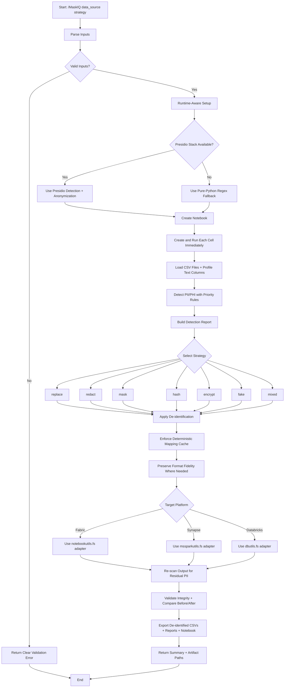

# MaskIQ End-to-End Flow

## Flow Diagram

## Purpose
This document defines the full operational flow for MaskIQ based on the current skill and instruction files.

## Inputs
- `data_source`: CSV file path, folder path, or glob pattern
- `strategy`: `replace` (default), `redact`, `mask`, `hash`, `encrypt`, `fake`, or `mixed`

## High-Level Flow
1. Receive command and parse inputs.
2. Validate input source and strategy.
3. Prepare runtime and dependencies.
4. Build and execute notebook cells end-to-end.
5. Detect PII/PHI across text columns.
6. Apply anonymization strategy.
7. Verify de-identification quality and integrity.
8. Export de-identified outputs and reports.

## Detailed End-to-End Steps

### 1) Invocation and Input Parsing
- User runs: `/MaskIQ <data_source> <strategy>`.
- If `strategy` is omitted, use `replace`.
- Resolve whether `data_source` is:
  - Single CSV file
  - Folder containing CSV files
  - Glob pattern matching one or more CSV files

### 2) Validation and Safety Checks
- Confirm source exists and resolves to at least one `.csv` file.
- Reject unsupported file formats.
- Validate strategy is one of supported options.
- Fail fast with a clear error when validation fails.

### 3) Runtime-Aware Environment Setup
- Try binary-first dependency installation where platform constraints exist.
- Primary path: Presidio-based detection and anonymization.
- Fallback path: if native dependencies cannot be installed (for example, constrained Windows architectures), switch to pure-Python regex-based detection while preserving output schema.
- Keep behavior stable regardless of runtime path.

### 4) Notebook Construction and Execution Discipline
- Generate a notebook for reproducibility.
- **Critical requirement**: execute each code cell immediately after creating it.
- Stop and fix failures as soon as they occur so state stays valid.

### 5) Data Loading and Profiling
- Load all target CSV files.
- Identify text columns per dataset.
- Capture baseline profiling metadata:
  - row and column counts
  - data types
  - null rates
  - candidate PII-bearing columns

### 6) PII/PHI Detection
- Use Presidio analyzers and recognizers (or fallback detector if needed).
- Scan every text column across all rows.
- Record detections with metadata:
  - file name
  - row identifier or index
  - column name
  - entity type
  - confidence score
  - original matched value
- Apply explicit entity-priority ordering for overlap handling (specific entities before generic entities).

### 7) Strategy-Specific De-identification
- Transform detected PII according to selected strategy:
  - `replace`: substitute with entity tags
  - `redact`: remove values
  - `mask`: partially hide values while preserving useful shape
  - `hash`: salted SHA-256 deterministic mapping
  - `encrypt`: AES encryption (reversible)
  - `fake`: realistic pseudonyms with deterministic mapping cache
  - `mixed`: entity-type operator mapping

### 8) Referential Integrity and Determinism
- Maintain a session-wide mapping cache for deterministic modes (`hash`, `fake`, and deterministic `encrypt` behavior when enabled).
- Guarantee same source value maps to same transformed value across all files processed in the same run.

### 9) Format Fidelity Rules
- For structured fields (for example phone-like patterns), preserve important format characteristics where possible:
  - digit count
  - recognizable separators/pattern shape
  - region/prefix intent when derivable

### 10) Platform Utility Abstraction
- If target is Microsoft Fabric, use `notebookutils.fs.*` APIs.
- If target is Azure Synapse, use `mssparkutils.fs.*` APIs.
- If target is Databricks, use `dbutils.fs.*` APIs.
- Route storage operations through a small adapter layer so notebook logic remains reusable.

### 11) Post-Processing Validation
- Re-scan transformed outputs for residual PII.
- Compare before/after PII counts.
- Verify no strategy regressions (for example, cleartext leakage in transformed files).
- Validate referential integrity for fields expected to remain join-safe.

### 12) Export and Artifacts
- Save de-identified CSV outputs.
- Save PII detection report (tabular output).
- Save run notebook with full execution trail.
- Optionally save summary metrics and validation diagnostics.

### 13) Final Delivery
- Return:
  - list of processed files
  - selected strategy
  - key counts (records scanned, entities detected, entities transformed)
  - validation outcome
  - artifact locations

## Operational Guardrails from Current Instructions
- General coding baseline applies to all files.
- Python standards apply to `.py` work:
  - snake_case for variables and functions
  - CamelCase for classes
  - PEP 8 style
  - type hints for function parameters and returns
  - docstrings for public modules/classes/functions/methods
- Follow robust error handling for async or multi-step operations.

## Expected Outputs
- De-identified CSV files for every input CSV.
- Comprehensive PII detection report.
- Executed notebook containing complete transformation pipeline.
- Validation summary proving de-identification quality.

<!-- Contains AI-generated edits. -->
