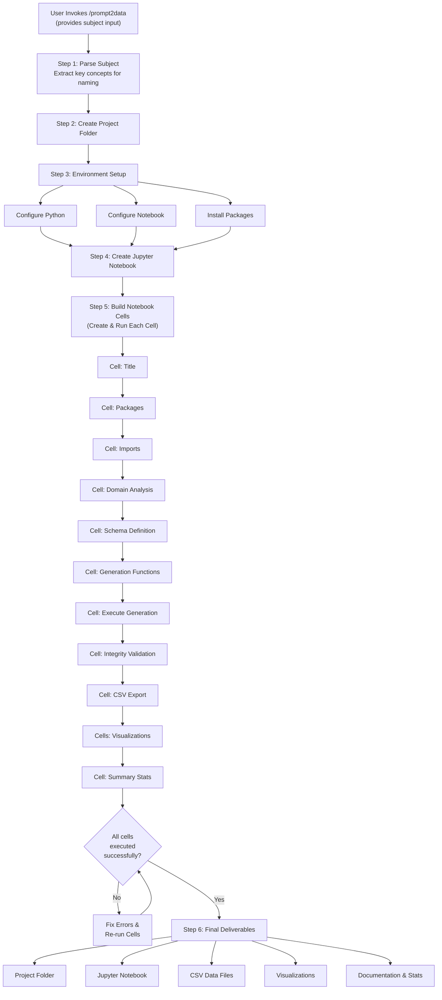

# Prompt2Data — Synthetic Data Generator Agent

> **Turn any subject into a realistic, analysis-ready dataset in seconds.**

Prompt2Data is a **custom agent** that generates comprehensive synthetic datasets from a plain-English description. It creates a dedicated project folder containing a fully-executed Jupyter notebook with data generation code, visualizations, statistical summaries, and a clean CSV export — all in one command.

# 🚀 How to Use
## 📋 Prerequisites
Before getting started, ensure you have the following set up:

- **VS Code** with the GitHub Copilot and GitHub Copilot Chat extensions installed  
- A **Python environment** with `pip` available  
  > *(Required packages will be installed automatically by the agent)*


## ⚙️ Setup & Run

### 1. Clone the Repository
``` git clone https://github.com/microsoft/HRDIUtilities/```
### 2. Open the Project
- Navigate to the Prompt2Data folder
- Open it in VS Code
### 3. Launch Copilot Chat
- pen the GitHub Copilot Chat extension inside VS Code
### 4. Run the Agent Command
Execute the following command in Copilot Chat:
```text
/prompt2data Generate a dataset for an HR system that captures organizational insights, compensation details, iterative changes, and location-based relationships.
```

## 🤖 How the Agent Works

Let's trace what happens when you run:
Workflow Diagram See [prompt2data-workflow-digram.md](prompt2data-workflow-digram.md) for the full Mermaid flowchart, or refer to the diagram below:

```text
/prompt2data Generate a dataset for an HR system that captures organizational insights,
compensation details, iterative changes, and location-based relationships.
```

### Step 1: Prompt Analysis — Domain Decomposition

The agent's first task is to analyze your natural-language input and identify the domain entities. For the HR prompt above, it identifies:

| # | Entity | Type | Description |
|---|---|---|---|
| 1 | **Locations** | Lookup | Office locations and sites |
| 2 | **Departments** | Lookup | Organizational departments |
| 3 | **Job_Titles** | Lookup | Job positions/roles with salary bands |
| 4 | **Employees** | Fact | Employee records with FKs to Locations, Departments, Job_Titles |
| 5 | **Compensation** | Fact | Compensation history/details with FK to Employees |
| 6 | **Org_Changes** | Fact | Promotions, transfers, raises with FK to Employees |

The agent classifies each entity as either a **lookup/dimension** table (relatively static reference data) or a **fact/transaction** table (event-driven records). This classification determines the generation order — parent tables must be created before child tables to ensure valid foreign keys.


### Step 2: Permission Requests

Before creating files or installing packages, the agent prompts for permission. VS Code shows an "Allow / Skip" dialog for each action:

- Creating the project directory
- Installing Python packages (`pandas`, `numpy`, `matplotlib`, `seaborn`, `scipy`)
- Creating and executing notebook cells


This permission model ensures the agent never takes destructive actions without user consent.

### Step 3: Environment Setup

The agent configures three things:

1. **Python environment** — Detects or sets up the active Python interpreter
2. **Notebook environment** — Configures Jupyter kernel settings
3. **Package installation** — Installs required dependencies:

```bash
%pip install pandas numpy matplotlib seaborn scipy
```

### Step 4: Notebook Generation (Cell by Cell)

The agent creates a Jupyter notebook and builds it **one cell at a time**, executing each cell immediately after creation. This is the "execute-after-create" pattern — it catches errors early and ensures the notebook state is always valid.

Here is the cell sequence:

#### Cell 1 — Title (Markdown)
A descriptive title and summary of what the dataset covers.

#### Cell 2 — Package Installation (Code)
```python
%pip install pandas numpy matplotlib seaborn scipy
```

#### Cell 3 — Library Imports (Code)
```python
import pandas as pd
import numpy as np
import matplotlib.pyplot as plt
import seaborn as sns
from datetime import datetime, timedelta
from scipy import stats
import os
```

#### Cell 4 — Domain Entity Analysis (Markdown)
A detailed explanation of each entity, its attributes, and relationships. This serves as documentation for anyone who opens the notebook later.

#### Cell 5 — Relational Schema Definition (Code)
```python
SCHEMA = {
    'locations': {
        'primary_key': 'location_id',
        'foreign_keys': {},
        'row_count': 15
    },
    'departments': {
        'primary_key': 'department_id',
        'foreign_keys': {},
        'row_count': 20
    },
    'job_titles': {
        'primary_key': 'job_title_id',
        'foreign_keys': {},
        'row_count': 30
    },
    'employees': {
        'primary_key': 'employee_id',
        'foreign_keys': {
            'location_id': 'locations.location_id',
            'department_id': 'departments.department_id',
            'job_title_id': 'job_titles.job_title_id'
        },
        'row_count': 500
    },
    'compensation': {
        'primary_key': 'compensation_id',
        'foreign_keys': {'employee_id': 'employees.employee_id'},
        'row_count': 1500
    },
    'org_changes': {
        'primary_key': 'change_id',
        'foreign_keys': {'employee_id': 'employees.employee_id'},
        'row_count': 800
    }
}
```

This schema definition is the blueprint. It explicitly declares primary keys, foreign key relationships, and expected row counts before any data is generated.

#### Cell 6 — Data Generation Functions (Code)
One function per entity, each with:
- **Type hints** on all parameters and return types
- **Realistic distributions** — not just `random.randint()`, but weighted choices, normal distributions with appropriate means and standard deviations, and correlated values
- **Foreign key resolution** — child table functions accept parent DataFrames as parameters and sample only from valid parent IDs

```python
def generate_employees(
    num_records: int = 500,
    locations_df: pd.DataFrame = None,
    departments_df: pd.DataFrame = None,
    job_titles_df: pd.DataFrame = None
) -> pd.DataFrame:
    """Generate employee records with valid FKs to parent tables."""
    valid_location_ids = locations_df['location_id'].tolist()
    valid_department_ids = departments_df['department_id'].tolist()
    valid_job_title_ids = job_titles_df['job_title_id'].tolist()
    # ... generate realistic employee data
```

#### Cell 7 — Data Generation Execution (Code)
Calls each function in **dependency order** — lookup tables first, then fact tables:

```python
df_locations = generate_locations(num_records=SCHEMA['locations']['row_count'])
df_departments = generate_departments(num_records=SCHEMA['departments']['row_count'])
df_job_titles = generate_job_titles(num_records=SCHEMA['job_titles']['row_count'])
df_employees = generate_employees(
    num_records=SCHEMA['employees']['row_count'],
    locations_df=df_locations,
    departments_df=df_departments,
    job_titles_df=df_job_titles
)
# ... and so on
```

#### Cell 8 — Referential Integrity Validation (Code)
A validation function checks that **every foreign key value** in every child table exists in the referenced parent table:

```python
def validate_referential_integrity(tables: dict, schema: dict) -> None:
    for table_name, table_schema in schema.items():
        for fk_col, ref in table_schema['foreign_keys'].items():
            ref_table, ref_col = ref.split('.')
            parent_ids = set(tables[ref_table][ref_col])
            child_ids = set(tables[table_name][fk_col])
            orphans = child_ids - parent_ids
            if orphans:
                raise ValueError(f"Orphan records in {table_name}.{fk_col}: {orphans}")
    print("Referential integrity check PASSED for all tables.")
```

#### Cell 9 — CSV Export (Code)
All DataFrames are exported to individual CSV files in the project folder:

```python
for table_name, df in all_tables.items():
    filename = f'synthetic_{SUBJECT_CLEAN}_{table_name}.csv'
    df.to_csv(filename, index=False)
    print(f"Saved {table_name}: {filename} ({len(df)} rows, {len(df.columns)} columns)")
```

#### Cells 10–N — Visualizations (Code)
Multiple visualization cells using matplotlib and seaborn:
- Bar charts for categorical distributions (employees per department)
- Box plots for numeric ranges (salary by job title)
- Scatter plots for correlations (tenure vs. compensation)
- Heatmaps for cross-table relationships
- Time series for temporal patterns (org changes over time)

#### Final Cells — Summary Statistics & Quality Checks (Code)
Descriptive statistics (`describe()`) for every table, plus data quality assertions.

### Step 5: Explore Your Outputs

When the agent finishes, your project folder looks like this:

```
hr_org_compensation_changes_locations/
├── synth_hr_org_compensation_changes_locations.ipynb
├── synthetic_hr_org_compensation_changes_locations_locations.csv
├── synthetic_hr_org_compensation_changes_locations_departments.csv
├── synthetic_hr_org_compensation_changes_locations_job_titles.csv
├── synthetic_hr_org_compensation_changes_locations_employees.csv
├── synthetic_hr_org_compensation_changes_locations_compensation.csv
└── synthetic_hr_org_compensation_changes_locations_org_changes.csv
```

Open the notebook to review the visualizations, tweak parameters (like row counts), or regenerate with different distributions.

---

## What Gets Generated

Every run produces a notebook with a consistent structure:

| # | Cell | Type | Purpose |
|---|---|---|---|
| 1 | Title & description | Markdown | Documents the dataset |
| 2 | Package installation | Code | `pandas`, `numpy`, `matplotlib`, `seaborn`, `scipy` |
| 3 | Library imports | Code | All necessary imports |
| 4 | Domain entity analysis | Markdown | Entities, attributes, relationships |
| 5 | Relational schema definition | Code | Tables, PKs, FKs, row counts |
| 6 | Data generation functions | Code | One function per entity with type hints |
| 7 | Parameter configuration | Markdown | Explains tunable parameters |
| 8 | Data generation execution | Code | Calls functions in dependency order |
| 9 | Referential integrity validation | Code | Proves all FKs are valid |
| 10 | CSV export | Code | One CSV per entity |
| 11 | Entity-relationship diagram | Markdown | Text-based ER diagram |
| 12–N | Visualizations | Code | matplotlib & seaborn charts |
| N+1 | Summary statistics | Code | `describe()` per table |
| N+2 | Validation & quality checks | Code | Data realism assertions |

---

## Workflow Diagram

The complete end-to-end workflow can be visualized as:



---

## Data Quality, Compliance, and Security

### Realistic Data Patterns

Prompt2Data doesn't just generate random numbers. The agent is instructed to produce data with:

- **Appropriate statistical distributions** — Salaries follow log-normal distributions, not uniform random
- **Correlations between variables** — Tenure correlates with compensation level; seniority correlates with department size
- **Temporal patterns** — Seasonal hiring spikes, quarterly compensation reviews
- **Natural noise and outliers** — Just like real data, not everything is perfectly clean
- **Domain constraints** — No negative salaries, no future hire dates, no employees reporting to themselves

### Microsoft CELA Guidelines for Open Data

When publishing or sharing synthetic datasets, the project follows Microsoft's **Corporate, External, and Legal Affairs (CELA) Guidelines for Open Data**:

- **Licensing** — Use an approved open data license that clearly states reuse rights
- **Privacy** — Verify that no real personally identifiable information (PII) leaks into synthetic outputs
- **Attribution** — Provide clear provenance and generation metadata
- **Quality** — Document known limitations, biases, and intended use cases

Full guidelines: [Microsoft Open Data](https://docs.opensource.microsoft.com/opendata/)

### PII Detection with Microsoft Presidio

Even though Prompt2Data generates fully synthetic data, the project recommends using [Microsoft Presidio](https://microsoft.github.io/presidio/) to validate outputs:

```bash
pip install presidio-analyzer presidio-anonymizer
python -m spacy download en_core_web_lg
```

| Use Case | How It Helps |
|---|---|
| **Validate synthetic data** | Run Presidio's analyzer over generated CSVs to confirm zero real PII was accidentally embedded |
| **Real → Fake pipeline** | Use Presidio + OpenAI to turn real text into realistic fake text |
| **De-identify before training** | If augmenting synthetic data with real-world samples, Presidio strips PII first |

---

## Try It Yourself

### Prerequisites

- **VS Code** with GitHub Copilot and GitHub Copilot Chat extensions installed
- A **Python environment** with `pip` available (packages are installed automatically)

### Quick Start

1. **Clone the repository**
   ```bash
   git clone https://github.com/microsoft/HRDIUtilities/
   ```

2. **Open in VS Code**
   Navigate to the `Prompt2Data` folder and open it in VS Code.

3. **Open Copilot Chat**
   Launch the GitHub Copilot Chat panel.

4. **Run the agent**
   ```text
   /prompt2data Generate a dataset for an HR system that captures organizational insights,
   compensation details, iterative changes, and location-based relationships.
   ```

5. **Explore outputs**
   Open the generated notebook, review visualizations, tweak parameters, or regenerate.

### Example Prompts

Try these to see the agent's versatility across completely different domains:

```text
/prompt2data chicago parking meters over the last 6 months
/prompt2data sales data for retail stores across 5 regions
/prompt2data patient visit records for a hospital network
/prompt2data university course enrollment and grading system
/prompt2data IoT sensor readings from a smart factory
```

Each prompt produces a completely different set of normalized tables, tailored to the domain described.

---

## How to Build Your Own Copilot Agent

Inspired by Prompt2Data? Here's the minimal recipe to create your own VS Code Copilot agent:

### 1. Create the Prompt File

Place a `.prompt.md` file in `.github/prompts/`:

```yaml
---
description: "What your agent does"
mode: agent
tools: ['editFiles', 'runCommands']
---

# Your Agent Name

Your instructions go here. Use ${input:paramName} for user input.
```

### 2. Add Instruction Files (Optional)

Place `.instructions.md` files in `.github/instructions/` to apply coding standards:

```yaml
---
applyTo: "**/*.py"
---

# Python Standards
- Follow PEP 8
- Use type hints
```

### 3. Invoke Your Agent

In Copilot Chat, type `/your-agent-name` followed by your input.

That's it. No extension to build, no server to deploy, no API keys to manage. The entire agent is defined in Markdown.

---

## Key Design Decisions

### Why Jupyter Notebooks?

We chose Jupyter notebooks as the output format for several reasons:

1. **Reproducibility** — Anyone can re-run the notebook to regenerate data with different parameters
2. **Documentation built-in** — Markdown cells explain the schema, relationships, and design decisions inline with the code
3. **Visualizations included** — Charts render directly in the notebook without additional setup
4. **Iterative exploration** — Users can modify individual cells to adjust distributions, add columns, or change row counts

### Why Multiple CSV Files Instead of One?

Real-world data is relational. A single flat CSV with everything denormalized is useful for quick analysis but falls apart when you need to:

- Test JOIN queries in SQL
- Build a data warehouse or lakehouse
- Model foreign key constraints
- Simulate realistic data volume ratios (few departments, many employees, even more transactions)

Prompt2Data's multi-table approach produces data that mirrors production systems, making it ideal for realistic testing and prototyping.

### Why Execute-After-Create?

The pattern of running each notebook cell immediately after creating it is critical for reliability. Without it:

- A typo in Cell 3 would go unnoticed until Cell 12 fails with a cryptic error
- The notebook state would be inconsistent — variables defined but never initialized
- The user would receive a notebook that looks complete but doesn't actually run

By executing each cell in sequence, the agent catches errors at the point of creation and can self-correct before moving on.

---

## Conclusion

Prompt2Data demonstrates how VS Code's Copilot agent customization framework can solve real workflow problems with nothing more than well-crafted Markdown files. No custom extensions. No backend services. No API integrations. Just a prompt file that teaches Copilot how to be a data scientist.

The result: a single sentence in Copilot Chat becomes a fully normalized, validated, visualized synthetic dataset — ready for dashboards, pipeline testing, ML training, or demos.

The entire project is open source. Clone the repo, try the example prompts, and build your own agents.

---

## References

- [VS Code Copilot Customization](https://code.visualstudio.com/docs/copilot/copilot-customization)
- [Microsoft Open Data Guidelines](https://docs.opensource.microsoft.com/opendata/)
- [Microsoft Presidio](https://microsoft.github.io/presidio/)
- [Prompt2Data Repository](https://github.com/microsoft/HRDIUtilities/)

<!-- Contains AI-generated edits. -->
