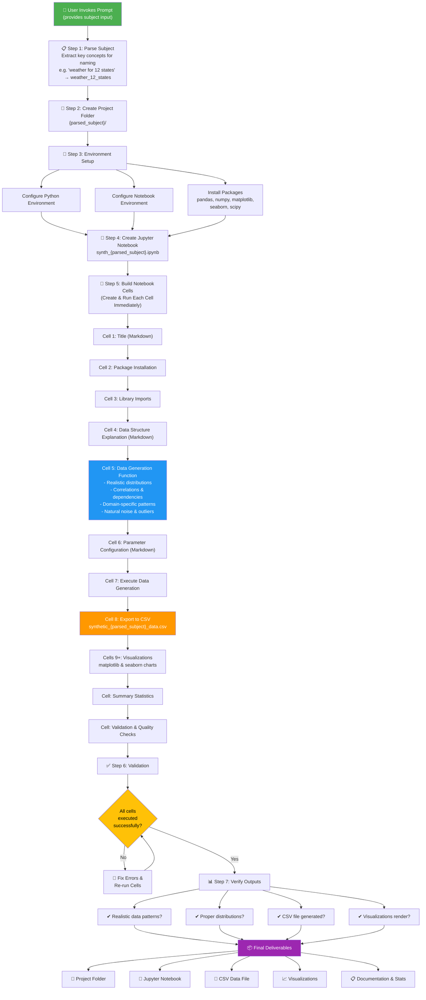

# Prompt 2 Data Generator Agent - End-to-End Workflow

```mermaid
flowchart TD
    A["🚀 User Invokes Prompt\n(provides subject input)"] --> B["📋 Step 1: Parse Subject\nExtract key concepts for naming\ne.g. 'weather for 12 states' → weather_12_states"]

    B --> C["📁 Step 2: Create Project Folder\n{parsed_subject}/"]

    C --> D["🔧 Step 3: Environment Setup"]
    D --> D1["Configure Python Environment"]
    D --> D2["Configure Notebook Environment"]
    D --> D3["Install Packages\npandas, numpy, matplotlib,\nseaborn, scipy"]

    D1 & D2 & D3 --> E["📓 Step 4: Create Jupyter Notebook\nsynth_{parsed_subject}.ipynb"]

    E --> F["📝 Step 5: Build Notebook Cells\n(Create & Run Each Cell Immediately)"]

    F --> F1["Cell 1: Title (Markdown)"]
    F1 --> F2["Cell 2: Package Installation"]
    F2 --> F3["Cell 3: Library Imports"]
    F3 --> F4["Cell 4: Data Structure Explanation (Markdown)"]
    F4 --> F5["Cell 5: Data Generation Function\n- Realistic distributions\n- Correlations & dependencies\n- Domain-specific patterns\n- Natural noise & outliers"]
    F5 --> F6["Cell 6: Parameter Configuration (Markdown)"]
    F6 --> F7["Cell 7: Execute Data Generation"]
    F7 --> F8["Cell 8: Export to CSV\nsynthetic_{parsed_subject}_data.csv"]
    F8 --> F9["Cells 9+: Visualizations\nmatplotlib & seaborn charts"]
    F9 --> F10["Cell: Summary Statistics"]
    F10 --> F11["Cell: Validation & Quality Checks"]

    F11 --> G["✅ Step 6: Validation"]
    G --> G1{"All cells\nexecuted\nsuccessfully?"}
    G1 -- No --> H["🔄 Fix Errors &\nRe-run Cells"]
    H --> G1
    G1 -- Yes --> I["📊 Step 7: Verify Outputs"]

    I --> I1["✔ Realistic data patterns?"]
    I --> I2["✔ Proper distributions?"]
    I --> I3["✔ CSV file generated?"]
    I --> I4["✔ Visualizations render?"]

    I1 & I2 & I3 & I4 --> J["📦 Final Deliverables"]

    J --> K["📁 Project Folder"]
    J --> L["📓 Jupyter Notebook"]
    J --> M["📄 CSV Data File"]
    J --> N["📈 Visualizations"]
    J --> O["📋 Documentation & Stats"]

    style A fill:#4CAF50,color:#fff
    style F5 fill:#2196F3,color:#fff
    style F8 fill:#FF9800,color:#fff
    style J fill:#9C27B0,color:#fff
    style G1 fill:#FFC107,color:#000
```

<!-- Contains AI-generated edits. -->
